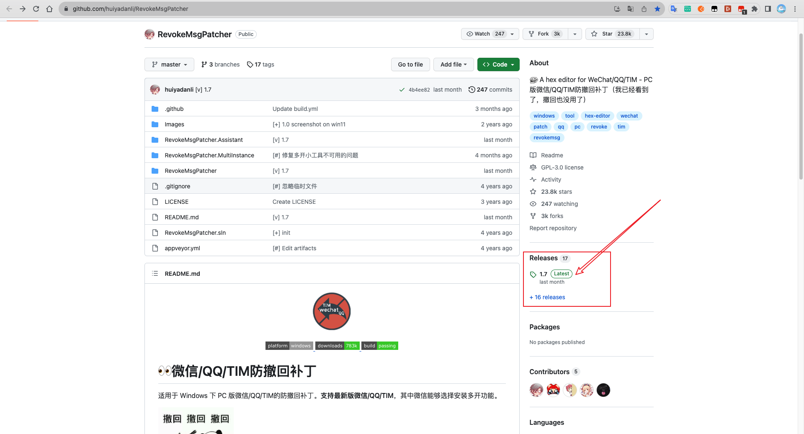
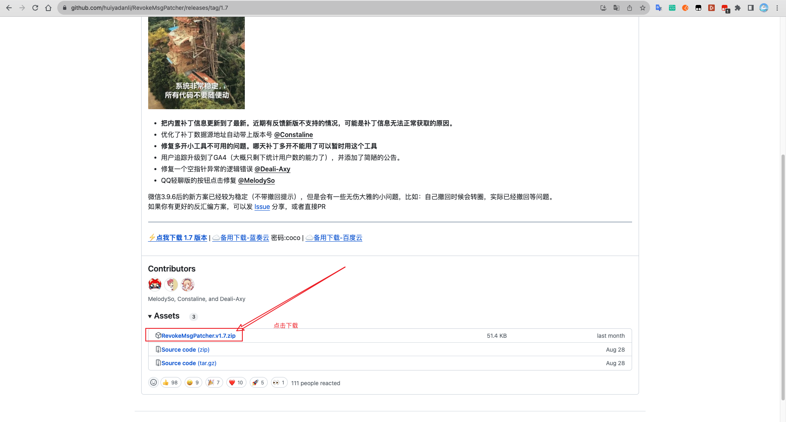
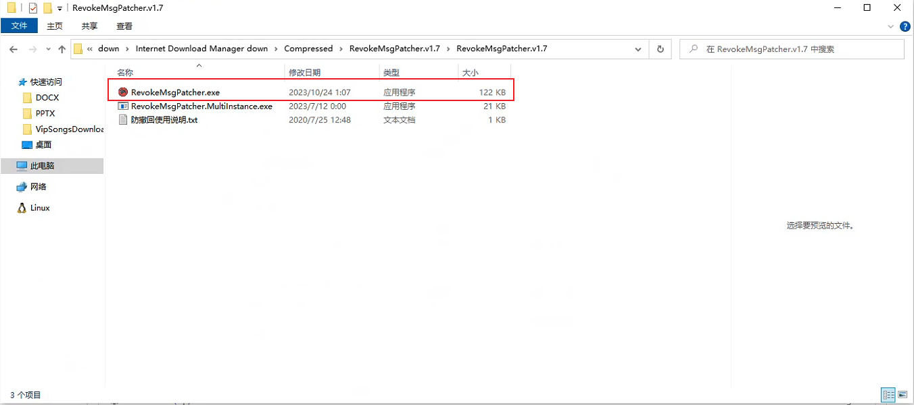
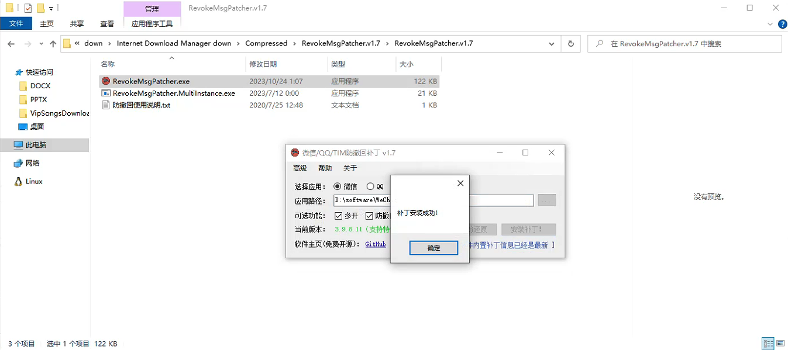

# win微信防撤回
###### 使用前，需要将微信退出！！！
1. 首先现在github上下载注入pc段微信插件小工具
   跳转页面 "**[微信/QQ/TIM防撤回补丁](https://github.com/huiyadanli/RevokeMsgPatcher)**" 
   1)点击 **Releases** 
   
   2）点击zip包进行下载
   
   
2. 解压下载下来的zip包；并双击打开 "**RevokeMsgPatcher.exe**" 文件
   
   
3. 选择微信，并勾选 “防撤回” 选项；然后点击 **“安装补丁”** 按钮
   
4. 安装成功后会弹出 **“补丁安装成功”** 小弹窗；表示安装成功
 
 
 
 - [ ] 备注:感谢 **"huiyadanli"** 大佬写的插件
